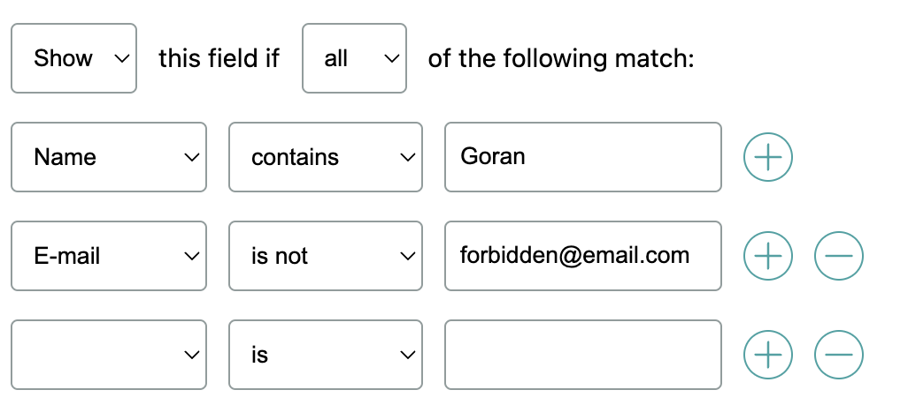

# Conditional logic repeater

A simple web component that allows adding multiple rules for conditionally rendering form fields.

## Usage

1. Import/enqueue the web component `.js` file
2. Use it in your markup:

```html
<conditional-logic-repeater fields='[{"label":"Name","value":"name"},{"label":"E-mail","value":"email"},{"label":"Date of birth","value":"dob"}]'></conditional-logic-repeater>
```

You can also provide a `class`, `id` or other `data-` attributes, just as with other HTML elements.

### Settable props

- **`fields`** - fields that are shown in the dropdown menu, should be provided as a JSON string (array of objects with label & value keys)
- **`toggleable`** - if set, enables the *Use conditional logic* toggle
- **`autoclear`** - if set, and the *Use conditional logic* toggle is disabled, the conditions get cleared
- **`value`** - if provided, sets the default value for the repeater, in the format of
  ```json
  {
  	"enabled": true,
  	"behavior": "show",
  	"logic": "and",
  	"conditions": [
  		{
  			"field": "email",
  			"comparison": "isnot",
  			"value": "test@email.com"
  		}
  	]
  }
  ```

### Gettable props

- **`conditions`** - all the conditions the user has set, in the format of
  ```js
  [
    { field: "", comparison: "is", value: "" },
    { field: "", comparison: "is", value: "" },
	...
  ]
  ```
  where `field` is the `value` of the chosen field (from the list of `fields`), `comparison` is the compare type, and `value` the entered value
- **`behavior`** - `show` or `hide`, depending on the user's choice
- **`logic`** - `and` (*all*) or `or` (*any*), depending on the user's choice

Props can be fetched just as with any other HTML element, e.g.
```js
const repeaterElement = document.querySelector('.demo-repeater');

if (repeaterElement.enabled) {
	console.log({
		enabled: repeaterElement.enabled,
		behavior: repeaterElement.behavior,
		logic: repeaterElement.logic,
		conditions: repeaterElement.conditions,
	});
} else {
	console.log('Repeater is disabled');
}
```

### Events
You can listen to changes to the repeater fields by hooking into the `es-conditional-logic-repeater-update` event.

Example:
```js
const repeaterElement = document.querySelector('.demo-repeater');

repeaterElement.addEventListener('es-conditional-logic-repeater-update', (e) => {
	console.log(e.detail);
});
```

Sample output:
```json
{
    "enabled": true,
    "behavior": "hide",
    "logic": "or",
    "conditions": [
        {
            "field": "demo",
            "comparison": "gt",
            "value": "20"
        }
    ]
}
```

### Parts & styling
If you want to change any part of the component visually, you can tweak stuff with CSS variables and Shadow DOM parts.

- `container` - main container of the whole element
- `use-toggle-label` - `<label>` for the _Use conditional logic_ toggle
- `use-toggle-checkbox` - checkbox element of the use toggle (you can also target the on state with `use-toggle-checkbox-enabled`)

- `header` - container of the top options ("_Show this field if all of the following match:_")
- `header-behavior-select` - `<select>` element for show/hide
- `header-logic-select` - `<select>` element for all/any

- `item` - single entry
- `item-field-select` - `<select>` element for the field
- `item-comparison-select` - `<select>` element for the comparison type
- `item-value-input` - `<input>` element for the value

- `add-condition-button` - the _Add condition_ (+) button
- `remove-condition-button` - the _Remove condition_ (-) button

Example of using parts:
```scss
// All repeaters
conditional-logic-repeater::part(header) {
	color: #FF0000;
}

// Specific repeater
.my-repeater::part(item) {
	border: 1px solid #FF00FF;
}
```

CSS variables used:
- `--es-conditional-logic-repeater-accent` - checkbox accent color
- `--es-conditional-logic-repeater-input-border` - text input fields and `<select>`s border colors
- `--es-conditional-logic-repeater-font-size` - font size for the component

## Setup

1. Clone
2. `npm install`

### Dev build
Run `npm run dev` in your terminal.

You will get a link in your terminal which you can open. A live server starts up and updates as you develop.

### Production build
Run `npm run build` in your terminal.

The compiled component will be in `dist/assets`, with a randomly generated filename.

## File & folder structure

- `dist`: _output folder_ (auto-generated on production builds)
- `src`: _source code_
  - `Repeater.svelte`: _the conditional-logic-repeater web component_
  - `main.js`: _supporting file for preparing the export of the web component_
- `index.html`: _Sample/demo page_
- other JSON/config files: _not important_

## How it works

Svelte has an option to export web components.

`Repeater.svelte` contains all the logic and styles for the component.

All the `export let` properties will be publicly accessible using JS when the exported component is used.

The `<svelte:options tag='conditional-logic-repeater' />` defines the custom element tag name.

For more info about the rest of Svelte logic and how it works, visit [the Svelte docs](https://svelte.dev/docs).


### Why Svelte?
Usually web components are pretty cumbersome to build, requiring a lot of code for not much work, all the fiddling with HTML templates, etc.

Svelte makes it all easier with its simple, yet powerful syntax.
